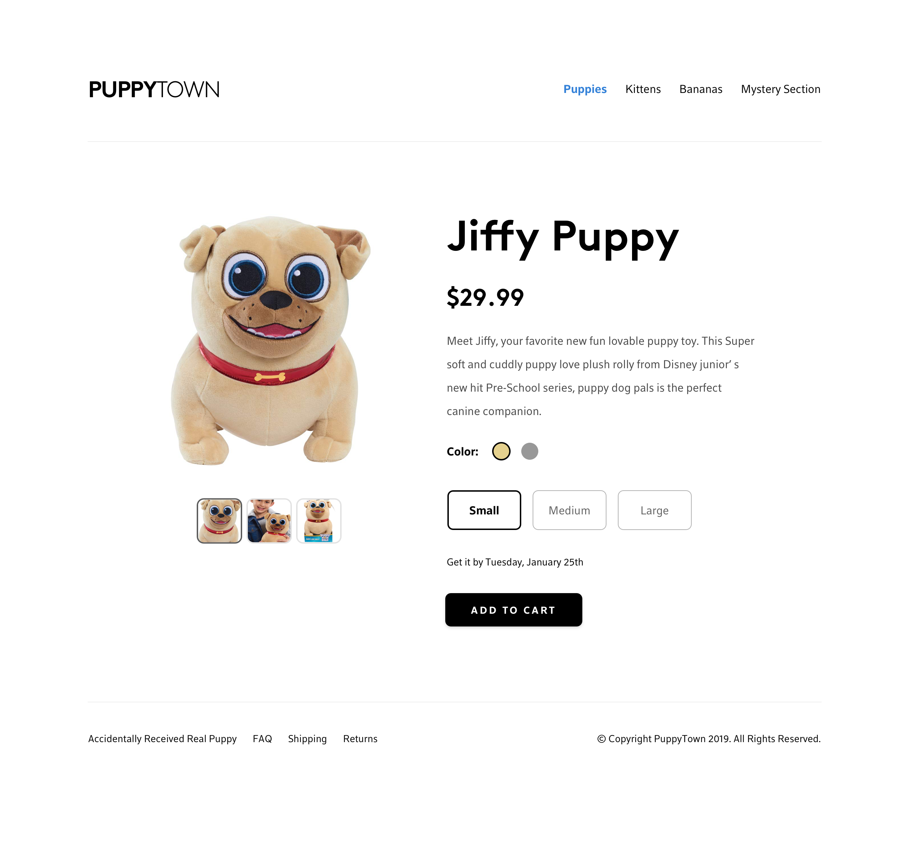

# Jiffy Puppy PDP Challenge

Hello, prospective Design Technologist Intern!

Thank you for taking time to help us assess your front-end development skills. Part of the work we are tasked with is combining business data with our design team's fresh new interfaces. Our developers make these come to life with semantic HTML, CSS, and JavaScript.

Your challenge is broken up into two parts.

1. Part one is to create an interactive product detail page for selecting a Jiffy Puppy variant based on the [provided wireframe](jiffy.png).
2. Part two is to create a user review section as well as a user review of a Jiffy Puppy variant that was purchased by a customer (for example, a review of a small, gold Jiffy Puppy).

When a user visits the page, they're greated by a default Jiffy Puppy variant. That is, a particular type Jiffy Puppy being offered. In the provided wireframe, the default Jiffy Puppy is size small in Gold. When a user selects different product options, the selected variant changes, which may result in a different price or color. The provided [product details data](data/product_details.json) has all the information you need to build these combinations.

The user review section need not include interactivity. We want to see your vision - in code - of what a good customer experience is for viewing product reviews, and we want you to defend your design decisions.

## Instructions
* Develop the HTML and CSS for the component seen in the screenshot above.
* Assume that your code would be handed off to a back-end developer for integration. It could end up on a page with other content and components, so keep this in mind when you are making decisions about naming conventions.
* The deliverable should include UI considerations contained in the data set, including (where applicable) a price difference and backordered status.
* End users should be able to see the price or image update when they use the component controls.
* Selecting a small image should trigger a change in the large image shown.
* Adding to cart need not have a click handler.
* We care more about functionality than style - we'd rather see a partially-styled working prototype than a pixel-perfect component that isn't doing price calculations. Try to balance your effort appropriately!
* It should go without saying - please comment your code to state any assumptions or decisions you're making during this assignment -- or just to say hi. :-)

## Requirements
* *Browser Support*: Google Chrome, Firefox, Safari for iOS, and Chrome for Android.
* *Libraries & Frameworks*: You are welcome to bring in JavaScript libraries (like jQuery or lodash) or frameworks (like Angular, React, Vue, or Stencil). You may also author your JS with vanilla DOM methods, as long as they are compatible with the browser requirements. Please don't include an entire CSS framework like Bootstrap -- we want to see your HTML and CSS, not theirs.
* *Time*: Please limit yourself to one week to work on your solution, and please work on this alone. You may look for guidence on developer forums such as [StackOverflow](http://stackoverflow.com).
* *Submission*: Fork this repository and make a pull request for us to review your code. If you're not familiar with git or Github, you can download this repo and send us a ZIP file when you're done.

## Stretch Goals

Stretch goals are considerations for future development. If you happen to have time to build the features below in code, so much the better, but we are more interested in having written statements on how you'd tackle these problems.

* How can you effectively use routing to deep-link to a particular variant?
* What should the user experience when they click the "Add to Cart" button?
* Make the UI mobile-responsive.
* Write JavaScript to request [product_details.json](data/product_details.json) via AJAX and populate the component with live data.

## Resources
* [StackOverflow](http://stackoverflow.com): The world's largest developer Q&A forum.
* Email us (jeffrey_smith4@comcast.com) if you get stuck or have questions.
